# 小章鱼 Agent (Clawd Octo Agent)

一个可爱的紫色小章鱼主题，为 [Clawd on Desk](https://github.com/rullerzhou-afk/clawd-on-desk) 设计。



## 特点

- 🐙 30个 CSS 动画 SVG 状态
- 👀 跟踪鼠标的眼球（idle 状态）
- 🎵 戴耳机听歌摇晃（groove 状态）
- 😤 连续戳会烦躁（annoyed 反应）
- 🌙 完整睡眠序列（打哈欠→打盹→倒下→沉睡→醒来）
- 🔨 工作状态分层（打字→杂耍→建造，按并发会话数自动切换）
- 📦 迷你模式支持（扒屏幕边框风格）

## 安装

### 方法1：手动安装

1. 下载本仓库
2. 将整个文件夹复制到 Clawd on Desk 主题目录：
   ```
   %APPDATA%\clawd-on-desk\themes\octo-agent\
   ```
3. 重启 Clawd on Desk
4. 在设置中选择「小章鱼多线程 Agent」主题

### 方法2：通过 Clawd 设置

1. 打开 Clawd on Desk 设置
2. 主题 → 导入 → 选择本仓库的 `theme.json`

## 状态一览

### 自动检测状态

| 状态 | 触发条件 | 文件 |
|------|---------|------|
| idle | 无活动，鼠标静止 | octo-idle-follow.svg |
| thinking | Claude 思考中 | octo-working-thinking.svg |
| working | Claude 输出中 | octo-working-typing.svg |
| juggling | 多并发会话 | octo-working-juggling.svg |
| notification | 需要授权 | octo-notif-notification.svg |
| error | 出错 | octo-notif-error.svg |
| attention | 任务完成 | octo-notif-happy.svg |
| sweeping | 通知清理 | octo-notif-sweeping.svg |
| carrying | 传递中 | octo-notif-carrying.svg |
| groove | 音乐播放（需外部脚本） | octo-working-headphones-groove.svg |

### 睡眠序列

| 状态 | 阶段 |
|------|------|
| yawning | 打哈欠 |
| dozing | 打盹 |
| collapsing | 倒下 |
| sleeping | 沉睡 |
| waking | 醒来 |

### 工作分层（workingTiers）

| 并发会话数 | 显示 |
|-----------|------|
| 1 | 打字（typing） |
| 2 | 杂耍（juggling） |
| 3+ | 建造（building） |

### 多任务分层（jugglingTiers）

| 并发会话数 | 显示 |
|-----------|------|
| 1 | 杂耍（juggling） |
| 2+ | 戴耳机（headphones） |

### 交互反应

| 反应 | 触发方式 |
|------|---------|
| drag | 拖拽 |
| clickLeft | 左键点击 |
| clickRight | 右键点击 |
| double | 双击 |
| annoyed | 连续戳 |

### 迷你模式

扒在屏幕顶部边框上的小章鱼，支持 idle、alert、happy、enter、peek、crabwalk、enter-sleep、sleep、typing 共 9 个状态。

## 音乐检测（groove 状态）

Clawd on Desk 目前没有内置音乐检测功能。如果你希望「听歌时章鱼自动戴耳机」，可以：

1. 在主题的 `theme.json` 中已配置好 `groove` 状态
2. 使用外部脚本检测音乐播放，通过 Clawd 的本地 API 发送状态：
   ```
   POST http://127.0.0.1:23333/state
   {"state": "groove", "event": "MusicStart", "agent_id": "music-detector"}
   ```

详细方案见 [音乐检测脚本](https://github.com/rullerzhou-afk/clawd-on-desk/issues) 中的 feature request。

## 配色方案

| 元素 | 颜色 |
|------|------|
| 身体 | #C8A2D8 |
| 身体高光 | #D8BAE8 |
| 触手 | #9B6BB0 |
| 触手尖 | #B08ACC |
| 脸颊 | #F4A0B0 |
| 眼睛 | #2D2D2D |
| 嘴巴 | #E87090 |
| 平台 | #D4C7E0 |

## 开发

SVG 动画使用 CSS keyframes（`tools/optimize_animations.py` 负责批量生成动画层）：

**运动层**
- `breathe` / `breatheSlow` / `breatheDeep` — 带挤压拉伸的呼吸（身体以坐姿点为轴心做轻微缩放，不是单纯的上下位移）
- `float` — 漂浮 + 微幅旋转
- `wobble` / `sway` — 以身体底部为轴心的左右摇晃
- `shake` / `shakeHard` — 抖动（含旋转，读起来像「烦躁」而不是画面抖动）
- `bounce` — 落地带挤压、起跳带拉伸的弹跳

**生命感细节**
- `tentacle` / `tentacleMini` — 每根触手独立波动，用负 `animation-delay` 做出从一侧扫到另一侧的波浪
- `tentacleTwitch` — 急促版触手摆动（烦躁状态用：周期从 3.4s 提到 1.7s，摆幅也加大）
- `blink` — 眼皮眨眼，每个循环末尾一次「双眨」，避免机械的等间隔
- `dart` — 眼珠不规则左右游移（烦躁状态用）
- `look` — 眼睛高光移动

**状态特效**
- `typepress` — 键盘按键
- `glow` — 发光
- `pulse` — 脉冲（缩放 + 透明度）
- `ink` — 墨汁扩散
- `smoke` — 冒烟
- `zz` — 睡眠气泡
- `sweep` / `scrub` / `dust` — 扫地三件套：扫帚以握把为轴心左右扫、身体**同向**小幅晃动、灰尘扬起后淡出（三者同频 1.5s）
- `anger` — 怒气符号跳动（烦躁状态）

> 表达「烦躁」要用**睁眼 + 急促眨眼 + 眼珠乱转 + 高频抖动**。把眼睛画成半眯（`scaleY` 半闭）会被读成「困倦」而不是「不耐烦」——这是踩过的坑。

**实现约定**
- 所有旋转/缩放的元素都显式写 `transform-origin`（用户坐标系 px 值），否则 SVG 会以视口原点为轴心转动，看起来像「甩飞」。
- 主题 SVG 会被净化：`@import`、`url(...)`、`<script>` 都会被剥离，动画只能用 `<style>` 里的 CSS `@keyframes`。
- 脚本里的 `STYLE` 是 30 个文件共用的 keyframes 库；只被个别状态用到的 keyframes 放在 `EXTRA_KEYFRAMES`，由 `second_pass()` 按需注入，避免其余文件背上用不到的定义。
- 脚本**不幂等**：正则锚点只匹配基线形态，重跑前必须先 `cp assets-v1/*.svg assets/`，否则会报锚点缺失。
- 改完脚本务必跑一遍内置自校验（XML 合法性 + 每个 `animation:` 引用的 keyframe 都有定义），它会在发现问题时返回非零。

## 许可

MIT License

## 致谢

- [Clawd on Desk](https://github.com/rullerzhou-afk/clawd-on-desk) — 桌宠框架
- [Clawd Plana](https://github.com/rullerzhou-afk/clawd-plana) — 主题参考
